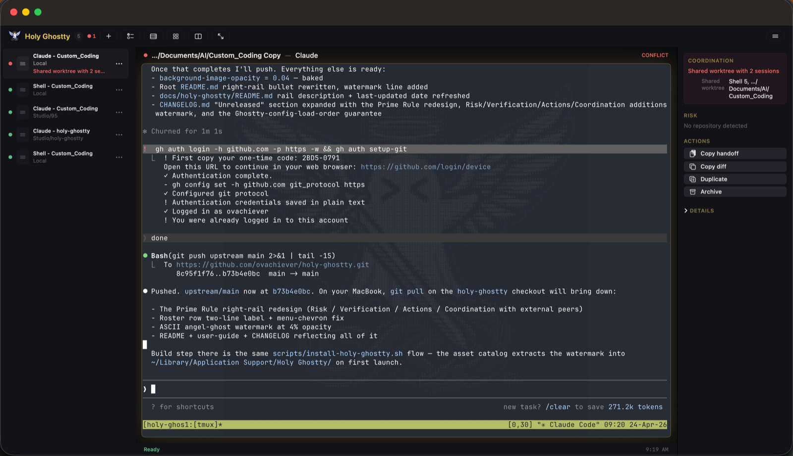

<p align="center">
  
</p>

<h1 align="center">Holy Ghostty</h1>

<p align="center">
  macOS control surface for durable local and SSH/tmux coding sessions, built on Ghostty.
</p>

<p align="center">
  <a href="./docs/holy-ghostty/README.md">Guide</a>
  ·
  <a href="./docs/holy-ghostty/engineering-spec.md">Engineering Spec</a>
  ·
  <a href="./docs/holy-ghostty/agent-sessions-interoperability.md">Interoperability</a>
  ·
  <a href="./CHANGELOG.md">Changelog</a>
</p>

<p align="center">
  
</p>

## Current State

Holy Ghostty is a product fork of Ghostty. The terminal core remains Ghostty. The Holy layer adds a native macOS workspace for launching, attaching, supervising, archiving, and restoring terminal-backed coding sessions.

Current Holy Ghostty release: `0.25`.

The app currently supports:

- Embedded live Ghostty surfaces.
- Shell, Claude, Codex, and OpenCode session runtimes.
- Local shell sessions.
- Local and remote SSH sessions attached through tmux.
- Remote host records with SSH config and Tailscale import.
- Remote tmux discovery and attach.
- Durable SQLite workspace persistence with migrations, WAL, and event history.
- Session archive, search, relaunch, and recovery context.
- Launch templates and external task records.
- Runtime telemetry inferred from terminal state, shell integration, and runtime output.
- Budget telemetry and budget enforcement policy fields.
- Git snapshot tracking for local and remote sessions.
- Worktree and branch coordination checks for non-shell agent sessions.
- Manual session ordering in the left roster.
- Focus, grid, and compare display modes.
- URL scheme, shell helper, and AppleScript session spawn entrypoints.

## User Interface

Standard mode has three regions:

- Left roster: active sessions in persisted manual order. Each row shows `Runtime - Project` on the first line and `Host/tmux-session` or `Local` on the second line.
- Center surface: selected live Ghostty terminal surface.
- Right inspector: git risk, coordination, verification, actions, and launch details for the selected session.

Toolbar controls:

- `+`: create a new local shell session immediately.
- checklist: open task inbox.
- server: open remote hosts.
- grid: toggle grid mode.
- split: toggle compare mode.
- diagonal arrows: toggle focus mode.
- menu: templates, task inbox, remote hosts, history, duplicate, archive.

Window behavior:

- Empty top-bar space drags the window.
- App content does not drag the window.
- The left roster width is persisted and can be resized below its default.

## Runtime Status

Runtime status is inferred. Holy Ghostty does not receive structured internal state from Claude, Codex, or OpenCode.

Current inputs:

- Ghostty surface state.
- Ghostty progress reports.
- OSC 133 shell integration command-finished events.
- Visible terminal output near the bottom of the screen.
- tmux session metadata.
- SSH-based git probes for remote sessions.

The parser filters terminal chrome, tmux status bars, separators, and prompt/footer lines before reporting activity. Stale telemetry is cleared when there is no current structured signal.

Displayed phase labels:

- `Ready`
- `Working`
- `Needs Input`
- `Complete`
- `Issue`

## Requirements

- macOS 15 or newer.
- Xcode 26 or newer.
- Xcode Metal Toolchain component:

```bash
xcodebuild -downloadComponent MetalToolchain
```

- Zig 0.15.2.

Zig minor versions are not interchangeable for this project.

## Build

Build the Zig core and generated framework:

```bash
zig build -Demit-xcframework
```

Build the macOS app:

```bash
xcodebuild -project macos/Ghostty.xcodeproj -scheme Ghostty -configuration Debug SYMROOT=build build
```

Install and launch:

```bash
scripts/install-holy-ghostty.sh Debug
open -a "Holy Ghostty"
```

Installed app path:

```text
/Applications/Holy Ghostty.app
```

Build only the shared Ghostty core:

```bash
zig build -Demit-macos-app=false
```

## Data Locations

Debug bundle identifier:

```text
org.holyghostty.app.debug
```

Workspace database:

```text
~/Library/Application Support/org.holyghostty.app.debug/HolyGhostty/holy-ghostty.sqlite3
```

User Claude state is outside the repo and is not managed by Holy Ghostty:

```text
~/.claude
```

## Repository Layout

- `src/`: Ghostty Zig terminal core.
- `macos/`: macOS application target.
- `macos/Sources/HolyGhostty/`: Holy Ghostty Swift app layer.
- `docs/holy-ghostty/`: Holy Ghostty documentation.
- `scripts/`: local build, install, and spawn helpers.
- `pkg/`: vendored build dependencies used by Ghostty.

## Public Scope

This repository is source-ready. It is not a signed, notarized, or packaged release channel.

Known gaps:

- Runtime status is heuristic rather than provider-native.
- Remote orchestration is tmux/SSH based.
- Broadcast input and dependency-chain automation are not implemented.
- External task status writeback is not implemented.
- User-facing preferences are limited.
- Signing, notarization, and release packaging are not configured.

## Upstream

Holy Ghostty depends on Ghostty.

- Upstream repository: <https://github.com/ghostty-org/ghostty>
- Upstream documentation: <https://ghostty.org/docs>
