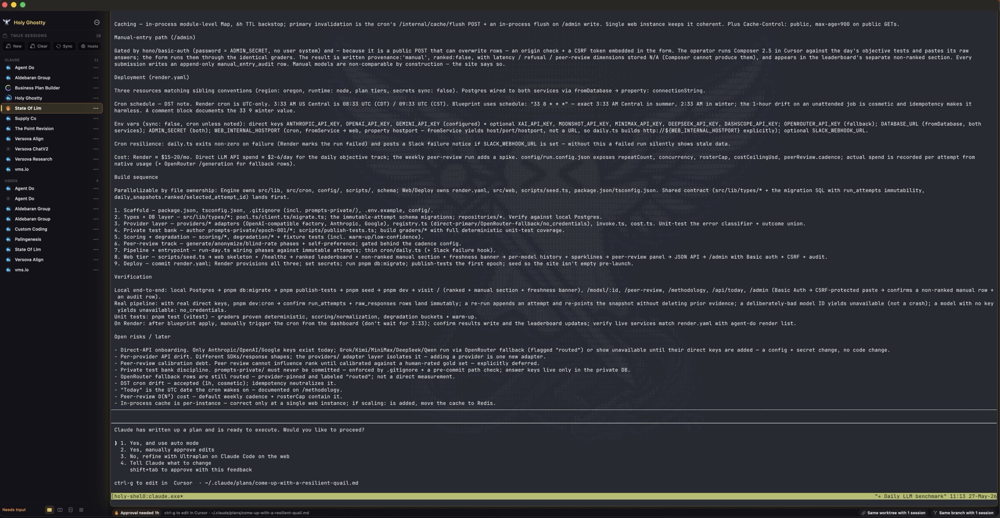

<p align="center">
  
</p>

<h1 align="center">Holy Ghostty</h1>

<p align="center">
  macOS control surface for durable local and SSH/tmux coding sessions, built on Ghostty.
</p>

<p align="center">
  <a href="./docs/holy-ghostty/README.md">Guide</a>
  ·
  <a href="./docs/holy-ghostty/engineering-spec.md">Engineering Spec</a>
  ·
  <a href="./docs/holy-ghostty/agent-sessions-interoperability.md">Interoperability</a>
  ·
  <a href="./CHANGELOG.md">Changelog</a>
</p>

<p align="center">
  
</p>

## Current State

Holy Ghostty is a product fork of Ghostty. The terminal core remains Ghostty. The Holy layer adds a native macOS workspace for launching, attaching, supervising, archiving, and restoring terminal-backed coding sessions.

Current Holy Ghostty release: `0.40`.

The app currently supports:

- Embedded live Ghostty surfaces.
- Shell, Claude, Codex, and OpenCode session runtimes.
- Local shell sessions.
- Local and remote SSH sessions attached through tmux.
- Remote host records with SSH config and Tailscale import.
- Remote tmux discovery and attach.
- Launch profiles for local and SSH/tmux session starts, including a persisted default target for `New`.
- Durable SQLite workspace persistence with migrations, WAL, and event history.
- Session archive, search, relaunch, and recovery context.
- Launch templates and external task records.
- Authoritative six-state agent indicators driven by structured lifecycle hooks for Claude Code, Codex, and OpenCode, with a metadata-only wire contract.
- A watcher eye marking sessions armed with a scheduled `/loop` wakeup, with the fire time in the tooltip.
- Deterministic agent notifications (replied, needs you, failed) with restart-safe deduplication.
- Runtime telemetry inferred from terminal state, shell integration, and runtime output.
- Budget telemetry and budget enforcement policy fields.
- Git snapshot tracking for local and remote sessions.
- Worktree and branch coordination checks for non-shell agent sessions.
- Runtime-grouped left roster sorted by project/folder context.
- Holy-owned pane layouts: single session, side-by-side split, stacked split, and quad.
- Detach-all, per-session detach, and tmux kill controls for session cleanup.
- URL scheme, shell helper, and AppleScript session spawn entrypoints.

## User Interface

Standard mode defaults to two working regions:

- Left roster: active sessions grouped by runtime (`Claude`, `Codex`, `OpenCode`, `Shell`) and sorted by project/folder context.
- Center surface: selected live Ghostty terminal surface.
- Optional inspector: git risk, coordination, verification, actions, and launch details for the selected session.

Roster rows are intentionally dense. Each row leads with the project or parent folder name, uses a single activity orb on the left, and only shows compact risk icons when there is something to notice.

Left rail controls are scoped to the tmux roster.

Session roster controls:

- `New`: start a tmux-backed session from the selected default launch profile.
- `Clear`: detach all visible sessions from the workspace roster without stopping tmux.
- `Sync`: refresh and reconnect tmux sessions in the roster.
- `Hosts`: open local and remote tmux hosts.
- `More`: launch profiles, templates, hosts, history, duplicate, detach, and kill from roster.

Holy Ghostty creates generated launch profiles for `Local Mac` and configured SSH hosts. The default `New` profile is stored in local SQLite state, so personal choices such as defaulting `New` to a remote workstation never need to be committed to the public repo.

Layout controls:

- `Single`, `Split Right`, `Split Down`, and `Quad` live at the bottom of the left rail.
- Layout changes are Holy visual layouts over durable tmux sessions, not tmux panes.
- Sessions shown in a split layout get `Left` / `Right`, `Top` / `Bottom`, or quadrant labels in the roster.
- The old Diff implementation is preserved in code for a later explicit agent/worktree comparison mode, but it is not exposed in the primary Level 1 chrome.
- `Tasks` and `Inspect` are hidden from the standard workspace for now.

The selected session's `...` menu separates cleanup actions:

- `Detach From Roster`: remove Holy's attachment while leaving the tmux session alive.
- `Kill from Roster`: attempt to kill the backing tmux session and always remove Holy's roster attachment.

Session cleanup shortcuts:

- `Command-W`: detach the selected session from the Holy workspace.
- `Option-Q`: kill the selected tmux session when the selected session has a tmux target.

Window behavior:

- The standard workspace removes empty native toolbar chrome; only the left rail reserves traffic-light clearance.
- The terminal surface starts at the top edge to maximize live terminal space.
- Holy defaults add top terminal padding so the first prompt row clears macOS window controls without adding a separate app bar.
- The bundled Holy background image stretches to the live terminal surface size.
- App content does not drag the window.
- The left roster width is persisted and can be resized below its default.
- The inspector is collapsed by default to reserve space for the terminal.

## Agent Indicators

Session status has two layers: authoritative indicators driven by structured
lifecycle hooks, and heuristic phase telemetry inferred from terminal output.

The authoritative layer is the roster's vocabulary. Claude Code, Codex, and
OpenCode publish lifecycle facts (working, needs-user, finished, failed, idle,
ended) through Holy-installed hooks into a metadata-only wire envelope; the
envelope never contains prompts, responses, or terminal text. Holy derives
exactly six mutually exclusive states from those facts plus its own persisted
seen and recency timestamps:

- Spinner: the agent is working, backed by a committed lifecycle event within
  its lease, extended past the lease only while the agent process is alive and
  visibly producing output, and dropped within a second of the process dying.
- Question mark: the agent needs you (a committed question, permission
  request, or failure).
- Green dot: an unread agent reply, cleared only by genuinely focusing the
  session.
- Blue dot: you prompted this session within 24 hours. Blue is earned by the
  operator alone; agent activity never fakes it.
- Grey dot: no prompt from you in 24 hours, but the session saw activity on
  some axis within 48.
- Sleeping Z: everything quiet for 48 hours or more.

A separate static watcher eye marks sessions armed with a scheduled `/loop`
wakeup, with the next fire time in the tooltip. Motion in the roster always
means compute burning; the eye is a promise to wake, so it does not move.

Hook installation is explicit and consent-gated behind the
`Enable Authoritative Agent Indicators` menu action. Holy merges only
exact-owned handlers, leaves unrelated configuration intact, and fails closed
on anything it does not own. Codex hook trust remains a manual `/hooks`
approval, and a foreign Codex notifier that chains Holy's adapter is accepted
as a delegation rather than blocked.

The heuristic layer supplements this with phase labels (`Ready`, `Working`,
`Needs Input`, `Complete`, `Issue`) inferred from Ghostty surface state,
OSC 133 shell integration, visible output, tmux metadata, and SSH git probes.
It feeds the bottom status chrome and stall detection; it never decides the
roster's six-state vocabulary. Shared worktree, shared branch, branch drift,
and overlapping-file risks use quiet inline icons beside the orb.

## Requirements

- macOS 15 or newer.
- Xcode 26 or newer.
- Xcode Metal Toolchain component:

```bash
xcodebuild -downloadComponent MetalToolchain
```

- Zig 0.15.2.

Zig minor versions are not interchangeable for this project.

## Build

Build, verify, install, and launch the supported app:

```bash
scripts/install-holy-ghostty.sh
open -a "Holy Ghostty"
```

The installer builds the complete core payload (`GhosttyKit.xcframework` plus
its generated resources) with Zig 0.15.2 and `ReleaseFast`, fingerprints its
inputs and outputs, builds the Swift app with `ReleaseLocal`, and refuses to
replace the installed app unless the finished executable reports that exact
verified core. The prior app is staged as a rollback until the replacement is
signed, registered, and reverified. It also checks the resolved ReleaseLocal
settings (`-O`, whole-module compilation, and assertions off) before building.

If Zig 0.15.2 cannot link against the installed macOS SDK, run the repository's
**Build Holy macOS core** workflow or download its newest
`HolyGhostty-Core-ReleaseFast-<commit>` artifact for the same core inputs. Then
import the zip contained in that download and rerun the installer:

```bash
scripts/build-holy-ghostty-core.sh import /path/to/HolyGhostty-Core-ReleaseFast.zip
scripts/install-holy-ghostty.sh
```

The artifact contains the framework, generated resources, and the same build
receipt. Different Swift-only commits are safe, while an incomplete, Debug,
wrong-source, or modified payload is rejected before the installed app is
touched. Main is rebuilt monthly so the 90-day Actions artifact does not expire
during normal repository operation.

For a build without installation, build the verified core first and then the
app:

```bash
scripts/build-holy-ghostty-core.sh build
xcodebuild -project macos/Ghostty.xcodeproj -scheme Ghostty -configuration ReleaseLocal SYMROOT=build build
```

Do not substitute a bare `zig build -Demit-xcframework`: Zig defaults that
command to Debug, and an Xcode-only build does not rebuild the core.

Installed app path:

```text
/Applications/Holy Ghostty.app
```

Build only the shared Ghostty core:

```bash
scripts/build-holy-ghostty-core.sh build
```

## Data Locations

Local app bundle identifier:

```text
org.holyghostty.app
```

Workspace database:

```text
~/Library/Application Support/org.holyghostty.app.debug/HolyGhostty/holy-ghostty.sqlite3
```

User Claude state is outside the repo and is not managed by Holy Ghostty:

```text
~/.claude
```

## Repository Layout

- `src/`: Ghostty Zig terminal core.
- `macos/`: macOS application target.
- `macos/Sources/HolyGhostty/`: Holy Ghostty Swift app layer.
- `docs/holy-ghostty/`: Holy Ghostty documentation.
- `scripts/`: local build, install, and spawn helpers.
- `pkg/`: vendored build dependencies used by Ghostty.

## Public Scope

This repository is source-release ready. GitHub releases may include an ad-hoc signed macOS app bundle zip. It is not notarized or distributed through a packaged installer channel.

Known gaps:

- Phase telemetry (the bottom status chrome) is heuristic; the roster's
  six-state indicators are hook-driven and authoritative.
- Remote orchestration is tmux/SSH based.
- Broadcast input and dependency-chain automation are not implemented.
- External task status writeback is not implemented.
- User-facing preferences are limited.
- Developer ID signing, notarization, packaged installer, and automated release workflow are not configured.

## Upstream

Holy Ghostty depends on Ghostty.

- Upstream repository: <https://github.com/ghostty-org/ghostty>
- Upstream documentation: <https://ghostty.org/docs>
