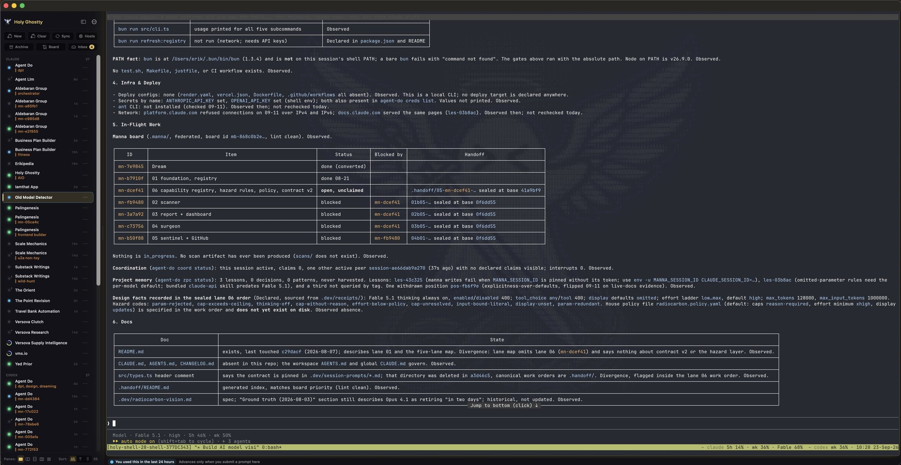

<p align="center">
  
</p>

<h1 align="center">Holy Ghostty</h1>

<p align="center">
  macOS control surface for durable local and SSH/tmux coding sessions, built on Ghostty.
</p>

<p align="center">
  <a href="./docs/holy-ghostty/README.md">Guide</a>
  ·
  <a href="./docs/holy-ghostty/engineering-spec.md">Engineering Spec</a>
  ·
  <a href="./docs/holy-ghostty/agent-sessions-interoperability.md">Interoperability</a>
  ·
  <a href="./CHANGELOG.md">Changelog</a>
</p>

<p align="center">
  
</p>

Holy Ghostty runs durable coding sessions and puts project work and conversation
history beside the terminal. Ghostty provides terminal rendering. The native
macOS workspace manages sessions, Board, Archive, and GitHub attention.

## Workspace

| Surface | Capability |
|---|---|
| Terminal | Local and SSH/tmux sessions for Shell, Claude, Codex, and OpenCode, with single, side-by-side, stacked, and quad layouts. |
| Board | Manna estate and project ledgers, human asks, peer activity, confirmed actions, cited board answers, and Claude or Codex worker dispatch. |
| Archive | Five-provider history indexing, transcripts, parent and child sessions, tags, notes, hybrid search, research chat, and remote archive browsing. |
| Inbox | GitHub attention for all repositories or the selected session's repository. |

`New` starts a tmux session from the default launch profile. `Hosts` manages SSH
hosts and discovers existing sessions. `Clear` detaches the roster while tmux
keeps running. `Sync` reconciles known sessions with the discovered inventory.
`Archive` and `Board` fill the terminal area; `‹ terminal` returns to live panes.
`Command-P` opens the GitHub dock.

Manna IDs highlighted in any pane Command-click through to their board item.
Holding Command over the roster turns session indicators into immediate kill
controls.

The roster sorts by runtime, attention, or pinned Today sessions. Session notes,
launch profiles, pane layouts, and workspace state persist locally. Explicit
launch runtimes control grouping. Git state and worktree checks identify shared
checkouts, branch drift, and changed-file overlap across distinct worktrees.

## Shared Session State

Enable **Authoritative Agent Indicators** from the app menu to install lifecycle
hooks for Claude Code, Codex, and OpenCode. The hooks publish metadata without
prompt or response text. Codex requires handler approval through `/hooks`.

The roster distinguishes working, needs-you, unread, used-today, inactive, and
sleeping sessions. Seen acknowledgements and prompt recency belong to the tmux
host, so attached Macs share the same state. A host-side journal restores missing
registers after reboot. Selecting a session in a background window does not mark
it read. Questions and permissions remain until the provider resolves them.

Session Restore groups interrupted sessions by shutdown. Captured conversation
identity selects the provider session. The native archive resolves fallback
candidates, with a picker for ambiguity and an explicit shell-only option when
history is absent. Claude, Codex, and OpenCode resume through provider-specific
commands.

## Board and Archive

Board requires `agent-do` and a Manna board on the selected host. It reads
`manna state --json` and `manna estate --json`. Changes require confirmation.
Type to filter the board; press Enter to ask a question. Answers link to cited
items. `Claim & build` opens a confirmed worker with the item's sealed handoff.

Archive reads Claude Code, Codex, Droid, Cursor, and OpenCode history into
`holy-archive.sqlite3`. Keyword search works locally without model credentials.
Semantic search requires a configured embedding provider and generated vectors.
Research chat uses an OpenAI API key available to the app process. Board model
requests use the configured Claude CLI or OpenAI route.

Configured SSH hosts contribute their own indexed archives. Remote rows show the
source host and freshness. Tags and notes are edited on the owning host.
Claude, Codex, and OpenCode conversations resume into that host's roster.
Droid and Cursor history is browsable.

See the [guide](docs/holy-ghostty/README.md) for setup, search syntax, model
configuration, and session controls.

## Usage Guard

Enable **Claude Usage Guard…** from the app menu. Account usage appears beside
the clock in the tmux status bar. **Claude Usage…** in the roster menu opens
reset times, projected caps, account readings, refresh, and manual wrap-up.

The defaults notify Claude at 75%, block new worker spawns at 90%, and request a
checkpoint and pause at 95% or within 20 minutes of the projected cap. Existing
work continues at the 90% tier. Per-session readings take precedence for their
account windows. Stale readings carry an age marker.

Codex contributes rate-limit, per-model, and reset-credit readings through
`codex app-server`. These are usage gauges; the installed guard hooks act on
Claude sessions. Provider limits still determine when requests are accepted.

## Requirements

- macOS 15 or newer.
- Xcode 26 or newer with the Metal Toolchain component.
- Zig 0.15.2 for the Ghostty core.
- tmux and the selected runtime executable on each session host.
- SSH access and Python 3 on remote hosts for metadata and archive queries.
- `agent-do` on hosts used for Board; authenticated GitHub access for the Inbox.

Install the Xcode component if needed:

```bash
xcodebuild -downloadComponent MetalToolchain
```

## Build and Install

The supported installer builds and verifies the core and app before replacing
the installed bundle:

```bash
scripts/install-holy-ghostty.sh
open -a "Holy Ghostty"
```

It builds the core with `ReleaseFast` and the Swift app with `ReleaseLocal`.
Source and payload fingerprints bind the framework and generated resources to
the executable. Installation retains the previous app for rollback until
signing, registration, and final verification pass.

For a build without installation:

```bash
scripts/build-holy-ghostty-core.sh build
xcodebuild -project macos/Ghostty.xcodeproj -scheme Ghostty -configuration ReleaseLocal SYMROOT=build build
```

The **Build Holy macOS core** workflow produces a verified core archive when the
local Zig toolchain cannot link the installed SDK. Import its contained zip:

```bash
scripts/build-holy-ghostty-core.sh import /path/to/HolyGhostty-Core-ReleaseFast.zip
scripts/install-holy-ghostty.sh
```

The importer checks current core inputs and all payload hashes. A bare
`zig build -Demit-xcframework` does not produce the supported release payload.
The installed bundle is `/Applications/Holy Ghostty.app`.

## Data and Automation

Workspace and Archive databases live under
`~/Library/Application Support/org.holyghostty.app/HolyGhostty/`.
Debug builds use the `org.holyghostty.app.debug` container.
Claude bridge helpers and usage history live under
`~/Library/Application Support/Holy Ghostty/`.
Provider history stays in each provider's own directory.

Sessions can also be created through `holy-ghostty://spawn`, AppleScript `spawn`,
and `scripts/holy-spawn-session.sh`.

Optional host administration tools are documented in the
[engineering spec](docs/holy-ghostty/engineering-spec.md#host-administration).

## Repository

- `src/` contains the Ghostty terminal core.
- `macos/Sources/HolyGhostty/` contains the native workspace.
- `docs/holy-ghostty/` contains the product guide and engineering contracts.
- `scripts/` contains build, installation, and session helpers.

Holy Ghostty is a macOS fork of [Ghostty](https://github.com/ghostty-org/ghostty).
Ghostty's terminal documentation is at [ghostty.org/docs](https://ghostty.org/docs).
